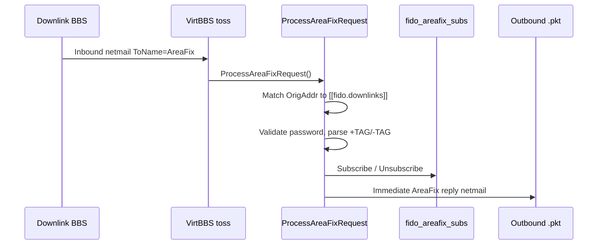

# AreaFix, FileFix, and TIC in VirtBBS

This document explains how VirtBBS handles FidoNet **AreaFix** (echomail subscriptions),
**FileFix** (file-echo subscriptions), and **TIC** (file distribution). It complements
the broader FidoNet setup guide in [`FidoNet Config.md`](FidoNet%20Config.md).

Implementation lives mainly in:

| Component | Source |
|-----------|--------|
| AreaFix responder/requester | `internal/fido/areafix.go` |
| FileFix responder/requester | `internal/fido/filefix.go` |
| Toss integration (inbound netmail) | `internal/fido/toss.go` |
| Scan fan-out to downlinks (echomail only) | `internal/fido/scan.go` |
| Subscription storage | `internal/messages/schema.sql` (`fido_areafix_subs`, `fido_filefix_subs`) |

---

## Overview

All three are part of classic FidoNet **hub/downlink** operation:

| Robot | Purpose | VirtBBS status |
|-------|---------|----------------|
| **AreaFix** | Subscribe/unsubscribe to **echomail** areas by netmail | Fully implemented (responder + requester + scan fan-out) |
| **FileFix** | Subscribe/unsubscribe to **file echo** areas by netmail | Responder + requester implemented; subscriptions stored |
| **TIC** | Distribute actual **files** for subscribed file areas (FTS-5005) | **Not implemented** — `tic_password` is reserved for future use |

VirtBBS plays two roles for each robot:

1. **Responder (hub)** — downlinks send netmail to `AreaFix` or `FileFix` at *your* address; VirtBBS validates them and updates subscriptions.
2. **Requester (downlink)** — *you* send netmail to your uplink's robot to request areas for yourself.

There is no TIC responder or requester code yet. FileFix only records *who wants which file areas*; nothing scans uploads and ships `.TIC` announcements the way `scan.go` ships echomail packets.

---

## Shared concepts

### Downlinks

A **downlink** is another BBS that polls *you* (rather than being dialed). Downlinks are configured per network in `VirtBBS.DAT`:

```toml
[fido]
  [[fido.downlinks]]
    name     = "Bob's BBS"
    address  = "1:2/4"
    password = "letmein"
```

For additional networks:

```toml
[[fido.networks]]
  name = "LovlyNet"
  # ...
  [[fido.networks.downlinks]]
    name     = "Member BBS"
    address  = "227:1/100"
    password = "secret"
```

The same downlink list is used for **AreaFix**, **FileFix**, and (when implemented) **TIC** authentication — one physical system, one password per network.

### Command syntax (AreaFix and FileFix)

Both robots use the same netmail body format (case-insensitive, one command per line):

```
<password>
+AREA_TAG
-OLD_TAG
%LIST
%QUERY
%HELP
```

| Command | Action |
|---------|--------|
| First non-blank line | Must match the downlink's configured `password` (or may be omitted if password is blank) |
| `+TAG` | Subscribe to area `TAG` |
| `-TAG` | Unsubscribe from area `TAG` |
| `%LIST` | List all areas available on this BBS |
| `%QUERY` | List current subscriptions for the sender |
| `%HELP` | Show command summary |

AreaFix netmail is addressed to **ToName `AreaFix`**. FileFix uses **ToName `FileFix`**.

### Passwords in config

| Config key | Who uses it |
|------------|-------------|
| `[[fido.downlinks]].password` | Downlinks sending AreaFix/FileFix (and future TIC) requests **to you** |
| `areafix_password` | **You** sending AreaFix requests **to your uplink** |
| `filefix_password` | **You** sending FileFix requests **to your uplink** |
| `tic_password` | **You** sending TIC requests **to your uplink** (reserved — no code yet) |

These keys exist on both `[fido]` (primary network) and each `[[fido.networks]]` entry.

---

## AreaFix (echomail)

### FidoNet convention

AreaFix is the standard way for a hub to manage which echomail areas each downlink receives. Downlinks email the robot; the hub replies with a confirmation netmail. No separate protocol or BinkP session is required beyond normal netmail flow.

### Responder flow



During **toss** (`internal/fido/toss.go`), inbound netmail with `ToName` matching `AreaFix` is routed to `ProcessAreaFixRequest()` before ordinary netmail storage rules apply. The function:

1. Confirms the sender's address matches a configured downlink (`NetworkDef.DownlinkByAddr`).
2. Validates the password from the first body line.
3. Applies `+TAG` / `-TAG` / `%LIST` / `%QUERY` / `%HELP`.
4. Validates echomail tags against conference `EchoTag` values (or legacy `[fido.areas]` map).
5. Writes an **immediate reply** netmail (`replyAreaFix`) to the outbound directory via `WritePKT` — **not** via the scan step. Subject is `AreaFix response`; routed via your uplink like any other netmail.

Upstream requests (`RequestAreaFix`) use subject `AreaFix`, write a `.pkt` immediately, and likewise bypass scan.

The original request is still stored as ordinary netmail for sysop audit.

### Scan fan-out (distribution)

When a downlink is subscribed to an echomail area, **scan** (`internal/fido/scan.go`) automatically includes them on export:

- For each message scanned out of a conference, VirtBBS builds the normal uplink `.pkt`.
- It also queries `AreaFixDB.SubscribedDownlinks(network, areaTag)` and writes **additional** `.pkt` files addressed directly to each subscribed downlink.
- Downlinks pick up their tagged mail when they poll your BinkP server.

Outbound `.pkt` filenames embed the destination address (e.g. `1z2n4` for `1:2/4`) so `binkpOutboundFilesFor()` in `internal/fido/binkp.go` can give each downlink only its own tagged packets; the uplink poll receives everything not tagged for a configured downlink.

This is subscription-driven — no per-conference uplink override is needed.

> **Note:** Export tracking is per-message, not per-destination. If the uplink packet succeeds but a downlink packet fails, the message is still marked exported.

### Requester flow (your uplink)

Set `areafix_password` to the password your uplink issued you, then send a request:

- **Terminal:** Sysop menu → FidoNet → `[A]reaFix` → `[U]pstream request`
- **Web:** Admin → FidoNet → Tools → AreaFix request form (`/admin/fido/tools`)

`RequestAreaFix()` composes netmail to **ToName `AreaFix`** at your uplink's address, with your password and `+TAG`/`-TAG` lines, and writes an outbound `.pkt` immediately.

Your uplink's AreaFix processes it and replies by netmail when ready.

### Database

Table `fido_areafix_subs`:

| Column | Meaning |
|--------|---------|
| `network` | Network name (e.g. `FidoNet`, `LovlyNet`) |
| `downlink_addr` | Downlink `zone:net/node` (point ignored) |
| `area_tag` | Echomail `AREA:` tag |

---

## FileFix (file echo subscriptions)

### FidoNet convention

FileFix mirrors AreaFix for **file echo** areas: downlinks subscribe to tags like `GAMES` or `UTILS` instead of echomail conferences. The netmail protocol is identical; only the robot name and tag namespace differ.

### Responder flow

Same shape as AreaFix, implemented in `ProcessFileFixRequest()` (`internal/fido/filefix.go`):

- Triggered during toss when `ToName` is `FileFix`.
- Uses the same `[[fido.downlinks]]` list and password rules.
- Validates tags against `[fido.file_areas]` / `[[fido.networks.file_areas]]` (maps tag → local file directory ID).
- Stores subscriptions in `fido_filefix_subs`.
- Sends an immediate FileFix reply netmail (subject `FileFix response`; also via `WritePKT`, not scan).

Example file-area mapping:

```toml
[fido]
  [fido.file_areas]
    GAMES = 1
    UTILS = 2
```

Directory IDs correspond to `internal/files.Dir.ID` (visible in the sysop Files menu or management API).

### Distribution (not implemented)

Unlike AreaFix, **no scan step consumes FileFix subscriptions today**. `FileFixDB.SubscribedDownlinks()` exists for a future file-echo pipeline but is not called anywhere.

A downlink can subscribe, receive a confirmation reply, and you can view subscriptions — but **no files are automatically sent** to downlinks based on those subscriptions.

### Requester flow (your uplink)

Set `filefix_password`, then:

- **Terminal:** Sysop menu → FidoNet → `[F]ileFix` → `[U]pstream request`
- **Web:** Admin → FidoNet → Tools → FileFix request form

`RequestFileFix()` sends netmail to **ToName `FileFix`** at your uplink.

### Database

Table `fido_filefix_subs` — same structure as AreaFix, with `file_tag` instead of `area_tag`.

---

## TIC (file distribution)

### FidoNet convention

**TIC** (Ticket Information Center, FTS-5005) is the mechanism that actually **moves files** in a file echo. When a hub receives or uploads a file in a file area, a TIC processor:

1. Builds a `.TIC` ticket describing the file (area, filename, size, CRC, etc.).
2. Bundles the file (often in a `.TIC` + file archive) for BinkP transfer to subscribed downlinks.

FileFix answers *"which areas does this downlink want?"* TIC answers *"here is the new file in that area."*

### VirtBBS status

| Item | Status |
|------|--------|
| `tic_password` config field | Present on `[fido]` and `[[fido.networks]]` |
| Downlink authentication for TIC | Intended to reuse `[[fido.downlinks]].password` (same as AreaFix/FileFix) |
| Inbound TIC processor | **Not implemented** |
| Outbound file scan / `.TIC` generation | **Not implemented** |
| BinkP file transfer for file echo | **Not implemented** |

Configure `tic_password` if your uplink requires it for when VirtBBS gains TIC support; it has no effect on runtime behaviour today.

When TIC is added, the expected shape is:

- **Inbound:** process TIC bundles from uplink during toss (similar to echomail packets) and install files into mapped `[fido.file_areas]` directories.
- **Outbound:** a file-scan step (parallel to `scan.go`) that watches subscribed directories, generates TIC announcements, and queues them for subscribed downlinks — using `fido_filefix_subs` the way echomail scan uses `fido_areafix_subs`.

---

## Comparison at a glance

| | AreaFix | FileFix | TIC |
|---|---------|---------|-----|
| **Netmail robot name** | `AreaFix` | `FileFix` | (none — binary/TIC protocol) |
| **Tag maps to** | Conference `EchoTag` / `[fido.areas]` | `[fido.file_areas]` → file dir ID | File area (via FileFix tags) |
| **Responder** | Yes | Yes | No |
| **Requester (to uplink)** | Yes | Yes | No |
| **Distribution after subscribe** | Yes — scan fan-out | No | No |
| **DB table** | `fido_areafix_subs` | `fido_filefix_subs` | (none yet) |
| **Uplink password config** | `areafix_password` | `filefix_password` | `tic_password` |

---

## Sysop operations

### Terminal (in-BBS sysop menu)

| Menu | Actions |
|------|---------|
| FidoNet → `[A]reaFix` | `[D]` add downlink, `[R]` remove downlink (clears AreaFix subs), `[U]` upstream AreaFix request, view subscriptions |
| FidoNet → `[F]ileFix` | `[U]` upstream FileFix request, view file-area subscriptions per downlink |

Removing a downlink via the AreaFix menu or web Downlinks page deletes its **AreaFix** subscriptions from `fido_areafix_subs`. **FileFix** subscriptions in `fido_filefix_subs` are not cleared automatically today — remove them manually via FileFix `-TAG` commands or direct DB maintenance if needed.

### Automatic nodelist echo subscription

When a VirtNet hub approves a new member (`ApplyNodeAnnounceInfo` in `internal/fido/nodeannounce.go`), VirtBBS auto-subscribes the member to the network's nodelist echo area via AreaFix (`OpenAreaFixDB().Subscribe(...)`), so new downlinks receive nodelist diffs without a separate AreaFix request.

### Web admin

| Page | URL | Capabilities |
|------|-----|--------------|
| Downlinks | `/admin/fido/downlinks` | Add, edit, remove downlinks; view AreaFix subscriptions and nodelist type |
| Tools | `/admin/fido/tools` | Send upstream AreaFix and FileFix requests (same as terminal `[U]`) |
| Networks | `/admin/fido/networks` | Edit `areafix_password`, `filefix_password`, `tic_password`, `[fido.file_areas]`, downlinks textarea |

Network config passwords and file-area maps are edited on the Networks page; day-to-day downlink maintenance is on the Downlinks page.

---

## Example netmail (downlink → your hub)

**AreaFix subscribe request** from `1:2/4` to your address:

```
To:   AreaFix
From: Bob Sysop @ 1:2/4

letmein
+VIRTBBS_SUPPORT
%QUERY
```

VirtBBS replies (subject `AreaFix response`) confirming subscription and listing current areas.

**FileFix** is the same with `To: FileFix` and file-area tags from your `[fido.file_areas]` map.

---

## Related reading

- [`FidoNet Config.md`](FidoNet%20Config.md) — §8 AreaFix, §9 FileFix/TIC, toss/scan/BinkP context
- `internal/fido/areafix.go` — command parser and reply writer
- `internal/fido/filefix.go` — FileFix mirror; documents TIC limitation in file header
- `internal/fido/scan.go` — echomail downlink fan-out (`appendEchoMessage`)
