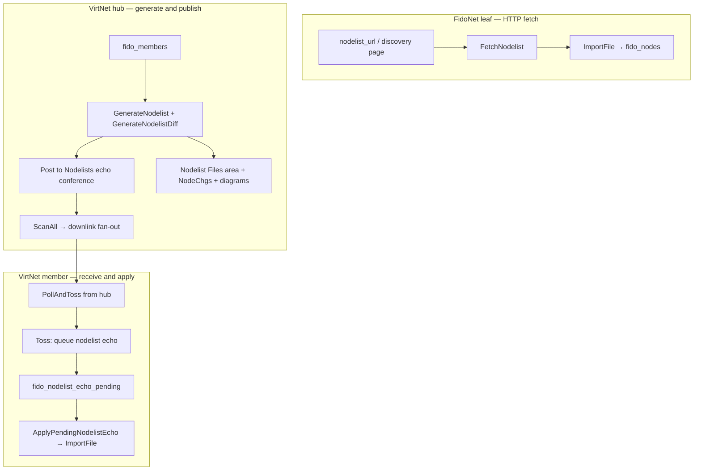

# VirtNet and Nodelist Auto-Processing

This document describes how VirtBBS keeps **nodelists** current automatically — both for classic **FidoNet** (downloading the Zone 1 daily list) and for **VirtNet** hub networks (generating, distributing, and applying member nodelists over echomail).

It complements the configuration reference in [`FidoNet Config.md`](FidoNet%20Config.md) §12 (FidoNet HTTP fetch) and the hub/downlink material in [`AreaFix FileFix TIC.md`](AreaFix%20FileFix%20TIC.md).

Implementation lives mainly in `internal/fido/nodelist*.go`, `internal/scheduler/scheduler.go`, and `internal/fido/toss.go`.

---

## Overview

VirtBBS maintains a searchable nodelist per configured network in SQLite (`fido_nodes`). Two independent pipelines feed that table:

| Network type | How the nodelist stays current | Trigger |
|--------------|----------------------------------|---------|
| **FidoNet leaf** (has uplink, `nodelist_url` set) | HTTP download → parse → full replace import | Scheduler every 24h (configurable) |
| **VirtNet hub** (no uplink, member-based nodelist) | Generate from `fido_members` → publish via echomail → members import on receipt | Daily rollover + startup file refresh |
| **VirtNet member** (has uplink to hub) | Receive hub's nodelist as echomail → queue → import | After poll/toss (see §5) |
| **Any network** | Manual import, local editor, CLI | Sysop action |



---

## Shared foundation: import and storage

All paths converge on the same import logic.

### `ImportFile` (`internal/fido/nodelist.go`)

1. Parses an FTS-0005 text nodelist (semicolon comments, `Zone`/`Host`/`Hub`/node lines).
2. **Deletes** all existing `fido_nodes` rows for that network name.
3. Inserts every parsed entry in a transaction.
4. Records `fido_nodelist_versions` (timestamp + node count) so clients (web, VirtAnd API) can detect changes.

Manual import uses the same function:

- **CLI:** `virtbbs -import-nodelist <path> -import-nodelist-net <network>`
- **In-BBS:** Sysop FidoNet menu → import nodelist file
- **Web admin:** `/admin/fido/nodelist` → Import File
- **API:** `fido.nodelist.import`

### On-disk layout

Each network has a `nodelist_dir` (e.g. `fido/nodelist`, `fido/VirtNet_nodelist`):

| File pattern | Meaning |
|--------------|---------|
| `NODELIST.###` / `VirtNode.Z###` | Full nodelist (day-of-year suffix) |
| `NODEDIFF.###` / `VirtNode.D###` | Diff (VirtNet text diff; FidoNet fetch does not apply diffs) |

### SQLite tables

| Table | Role |
|-------|------|
| `fido_nodes` | Searchable nodelist (routing, web UI, `[I] Ping`, Hold/Down checks) |
| `fido_nodelist_versions` | Last import time + count per network |
| `fido_members` | VirtNet hub: authoritative member registry |
| `fido_members_snapshot` | Daily snapshot for diff generation |
| `fido_nodelist_echo_pending` | Inbound VirtNet nodelist echomail awaiting file write + import |
| `fido_node_changelog` | Human-readable change log (`NodeChgs.txt`) |

---

## FidoNet automatic fetch (HTTP)

For networks **with an uplink** and a configured `nodelist_url`, VirtBBS downloads and imports the list on a timer — independent of BinkP poll/toss.

### Scheduler

`internal/scheduler/scheduler.go` → `runNodelistFetch`:

- Runs once per enabled network that has `NodelistFetchEnabled()` (non-blank effective URL).
- Default interval: **24 hours** (`DefaultNodelistInterval`); override with `nodelist_update_interval_hours` (minimum 1 hour).
- Calls `fido.FetchAndImport(nd, db)`.

### Download logic (`internal/fido/nodelistfetch.go`)

1. **`EffectiveNodelistURL()`** — per-network URL, or for the **primary** FidoNet network only, defaults to scanning `https://www.darkrealms.ca/` when blank.
2. **Discovery pages** — HTML is scanned for a table row containing `Fidonet Daily Nodelist (Z1/ZIP) day NNN`; the row's link is downloaded. The day number changes daily, so the page is re-scanned each fetch.
3. **Direct URLs** — Recognised by extension (`.zip`, `.lzh`, `NODELIST.###`, `.Z##`, etc.) and downloaded as-is.
4. **ZIP sniffing** — Response bytes are checked for `PK\x03\x04`; ZIP archives are extracted (first file) regardless of filename extension.
5. **Import** — Resulting file path is passed to `ImportFile`.

### Configuration

```toml
[fido]
  nodelist_url                   = ""   # blank on primary = darkrealms.ca discovery
  nodelist_update_interval_hours = 0    # 0 = 24h default

[[fido.networks]]
  name = "LovelyNet"
  nodelist_url = "https://example.com/NODELIST.ZIP"
```

Additional networks must set `nodelist_url` explicitly; there is no automatic discovery fallback for non-primary networks.

### Manual fetch

Same code path as the scheduler:

- **In-BBS:** `[L]oad nodelist now` (Sysop → FidoNet)
- **API:** `fido.nodelist.fetch` with `{"network": "<name>"}`

### Limitations

- **Full replace only** — each fetch imports the complete list; classic binary NODEDIFF patching is not applied on fetch.
- **Discovery page fragility** — if darkrealms.ca changes page layout/wording, logged errors repeat until you set a direct `nodelist_url`.

See [`FidoNet Config.md`](FidoNet%20Config.md) §12 for the full field reference.

---

## VirtNet hub: generation and daily rollover

A **hub network** has no uplink (`NetworkDef.IsHub()` → `uplink = ""`). When automatic HTTP fetch is **not** configured (`UsesMemberNodelist()`), the nodelist is built from **`fido_members`**, not from an imported FidoNet file.

### What gets generated

`RunDayRollover` (`internal/fido/nodelistrollover.go`) orchestrates the daily publish cycle:

| Output | Description |
|--------|-------------|
| `VirtNode.Z###` | Full FTS-0005 nodelist from all members (Zone line, Host `/0` per net, node lines, `IBN:` flags) |
| `VirtNode.D###` | Text diff vs yesterday's `fido_members_snapshot` (adds/changes as full lines; removals as `-Zone:Net/Node`) |
| Member snapshot | Today's `fido_members` copied to `fido_members_snapshot` for tomorrow's diff |
| `NodeChgs.zip` | Zip of `NodeChgs.txt` change log |
| `VirtDiag.zip` | Optional node topology PNG diagrams (requires `dot` on PATH) |

Files are written to `nodelist_dir` and registered in the auto-created file area **`"<NetworkName> Nodelist Files"`**.

### Echomail distribution

When `publish=true` (daily rollover, not startup):

1. Ensures echo conference **`"<NetworkName> Nodelists"`** with tag `nodelist_echo_tag` (default **`VNET.NODELIST`**).
2. Posts the full nodelist body as an echo message (`Subject: VirtNet Nodelist Z###`).
3. Posts the diff similarly (`Subject: VirtNet Nodelist Diff D###`).
4. **`ScanAll`** exports those messages; existing **AreaFix downlink fan-out** (`scan.go`) delivers copies to every downlink subscribed to the nodelist echo tag.

No separate TIC or file-echo transport is used for nodelists — the nodelist *is* the message body, distributed as ordinary echomail.

### Scheduler behaviour (`runDayRollover`)

For each enabled network **without uplink**:

| When | Action |
|------|--------|
| **Startup** | `RunDayRollover(publish=false)` — regenerate local files and refresh `fido_nodes` from members; **no** echomail posts (avoids duplicate distribution on restart) |
| **Every 24h** | `RunDayRollover(publish=true)` — full daily publish including echo posts |
| **Every 1 min** | `ProcessPendingNodelistEchoesForNetwork` — drain inbound nodelist echo queue for this hub network (see §5) |

**Manual rebuild:** Sysop can regenerate `VirtDiag.zip` without a full rollover:

- **Web admin:** `/admin/fido/ops` → **Rebuild network maps** (hub networks only)
- **In-BBS:** Sysop FidoNet menu → `[M] Rebuild maps`
- **CLI:** `virtbbs -fido-rebuild-maps -fido-rebuild-maps-net VirtNet`

### Member changes between rollovers

Approving a join request, processing a NodeAnnounce, or editing members triggers **`GenerateNodelist`** / **`RebuildHubNodelistDB`** so `fido_nodes` and on-disk files stay aligned with `fido_members` without waiting for midnight.

---

## VirtNet member: receiving and applying nodelists

Member nodes poll their hub via BinkP. The hub's daily nodelist arrives as echomail in area **`VNET.NODELIST`** (or your configured `nodelist_echo_tag`).

### Auto-subscription

Every new VirtNet member is **automatically** subscribed to the nodelist echo via AreaFix — the one subscription that cannot be opted out:

- On join approval (`members.go`)
- On new NodeAnnounce (`nodeannounce.go`)

Other echo areas still require an explicit AreaFix `+TAG` from the downlink.

### Toss: queue, don't import inline

During toss (`internal/fido/toss.go`), when an inbound message's `AREA:` tag matches `EffectiveNodelistEchoTag()`:

1. The message body is inserted into **`fido_nodelist_echo_pending`** via `QueueNodelistEcho`.
2. The message is still stored in the conference normally (sysops can read it in the UI).

Import is deferred because applying the nodelist requires writing files through `internal/files`, which `internal/fido` cannot import directly — the queue bridges that boundary.

### Apply: file write + import

`ProcessPendingNodelistEchoes` / `ProcessPendingNodelistEchoesForNetwork` (`internal/fido/nodelistecho.go`):

1. Derives filename from subject (`VirtNet Nodelist Z045` → `VirtNode.Z045`).
2. Writes body to **`<NetworkName> Nodelist Files`** (auto-created file area).
3. Registers the upload in the file catalog.
4. For full lists (`.Z` in filename): calls **`ImportFile`** → updates local `fido_nodes`.
5. **Diffs** (`.D` files) are stored but **not** auto-applied — only full lists trigger import today.

### When the queue is drained

| Host role | Drain mechanism |
|-----------|-----------------|
| **Hub** (no uplink) | Startup drain + 1-minute ticker in `runDayRollover` (`ProcessPendingNodelistEchoesForNetwork`) |
| **Member** (has uplink) | **Immediately after toss** in `TossDir` (post-poll) + startup drain + 1-minute ticker in `runNetwork` (`ProcessPendingNodelistEchoesForNetwork`) |

Both hub and member schedulers drain **one network at a time** so multi-network BBSes do not cross-apply echoes.

> **Fallback:** If echoes were queued while the scheduler was stopped, restart the server or wait up to one minute for the echo ticker. You can also import the latest `VirtNode.Z*` from **Nodelist Files** manually or run `fido.nodelist.import` against the saved path.

---

## Configuration reference

### FidoNet-style fetch

| Field | Location | Meaning |
|-------|----------|---------|
| `nodelist_url` | `[fido]` or `[[fido.networks]]` | Direct file URL or discovery page |
| `nodelist_update_interval_hours` | same | Fetch interval (0 = 24h, min 1h) |
| `nodelist_dir` | same | Where downloaded/generated files live |

### VirtNet hub / echo

| Field | Location | Meaning |
|-------|----------|---------|
| `uplink` | network entry | **Blank** = this BBS is the hub |
| `nodelist_echo_tag` | `[[fido.networks]]` only | Echo `AREA:` tag for nodelist distribution (default `VNET.NODELIST`) |
| *(no `nodelist_url`)* | hub networks | Hub uses member registry, not HTTP fetch |

Hub networks should **not** set `nodelist_url` unless you intentionally want imported FidoNet-style fetch instead of member generation (`UsesMemberNodelist()` becomes false when fetch is enabled).

---

## How nodelist data is used after import

| Consumer | Usage |
|----------|-------|
| **Web nodelist search** | `/nodelist`, admin browser |
| **Netmail routing** | `RouteAddr`, hub lookup, Hold/Down deferral (`nodelistdelivery.go`) |
| **BinkP dial decisions** | Skip outbound dial to Hold/Down nodes; defer to uplink |
| **VirtAnd / User API** | `fido.nodelist.version`, `fido.nodelist.search` — clients poll version to sync |
| **Local nodelist editor** | Edits `fido_nodes` + writes `NODEDIFF` for uplink notification (non-VirtNet hub path) |

Hold/Down entries from the nodelist cause VirtBBS to **queue mail for the uplink** instead of crash-dialing those addresses. Configured downlinks are exempt — they always receive mail when they poll you.

---

## Manual and administrative triggers

| Action | Entry point |
|--------|-------------|
| Fetch FidoNet nodelist now | Sysop `[L]oad nodelist now`, API `fido.nodelist.fetch` |
| Import file | CLI `-import-nodelist`, web `/admin/fido/nodelist`, API `fido.nodelist.import` |
| Regenerate VirtNet hub list | Member approve/edit (automatic), session menu regenerate, web admin |
| View pending echo queue | SQLite: `SELECT * FROM fido_nodelist_echo_pending` |
| Edit local entries | Web `/admin/fido/nodelist` local editor (`nodelistedit.go`) |

---

## Source file map

| File | Responsibility |
|------|----------------|
| `nodelist.go` | FTS-0005 parser, `ImportFile`, search/lookup |
| `nodelistfetch.go` | HTTP download, discovery page scan, ZIP extract |
| `nodelistgen.go` | VirtNet generation from members, diff, snapshots |
| `nodelistrollover.go` | Daily hub publish orchestration |
| `nodelistecho.go` | Inbound echo queue and apply |
| `nodelistedit.go` | Sysop local editor, own-node upsert, NODEDIFF export |
| `nodelistdelivery.go` | Hold/Down routing behaviour |
| `nodelistdisplay.go` | Formatting helpers |
| `members.go` / `nodeannounce.go` | Member registry + auto AreaFix nodelist subscription |
| `scheduler.go` | `runNodelistFetch`, `runDayRollover` timers |
| `toss.go` | Detect nodelist echo on inbound, queue for processing |

---

## Related documentation

- [`FidoNet Config.md`](FidoNet%20Config.md) — full `[fido]` field reference, §12 HTTP fetch, downlinks, routing
- [`AreaFix FileFix TIC.md`](AreaFix%20FileFix%20TIC.md) — downlink AreaFix subscriptions (including nodelist echo fan-out)
- [`BUILDING.md`](BUILDING.md) — build and run the server
