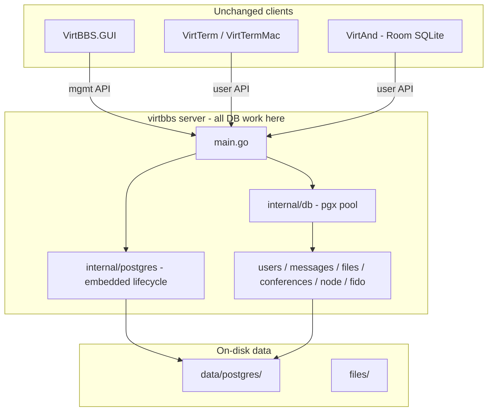

# SQLite to Bundled PostgreSQL Migration Plan

## Scope

| Component | Change needed? | Notes |
|-----------|----------------|-------|
| [`cmd/virtbbs`](cmd/virtbbs/main.go) + all `internal/*` stores | **Yes** | Only code that opens `data/virtbbs.db` |
| [`gui-dotnet/VirtBBS.GUI`](gui-dotnet/VirtBBS.GUI/) | Minor | API-only today; update config UI label (DB file path → Postgres status) |
| [`dotnet-virtterm`](dotnet-virtterm/), [`dotnet-virttermmac`](dotnet-virttermmac/) | **No** | JSON/TCP APIs unchanged |
| [`android/VirtAnd`](android/VirtAnd/) | **No** | Local `virtand.db` (Room) stays SQLite; syncs via User API |

Today the server opens **5 separate SQLite connections** to one file ([`users.Open(path)`](internal/users/store.go), [`messages.Open(path)`](internal/messages/store.go), etc.), with `SetMaxOpenConns(1)` only on the shared handle used by [`node.Open(db)`](internal/node/store.go). Postgres enables a **single shared pool** passed to every store.



---

## Phase 1: Embedded Postgres runtime

Add [`internal/postgres/runtime.go`](internal/postgres/runtime.go) using [`github.com/fergusstrange/embedded-postgres`](https://github.com/fergusstrange/embedded-postgres):

- Start Postgres before any store opens; stop on graceful shutdown (`defer runtime.Stop()` in [`cmd/virtbbs/main.go`](cmd/virtbbs/main.go)).
- Default data directory: `data/postgres/` (replacing `data/virtbbs.db`).
- Fixed local port (e.g. `54329`) or ephemeral with credentials written to `data/postgres/.connection` on first init.
- Create `virtbbs` role + `virtbbs` database on first run.
- Platform targets: `linux/amd64`, `linux/arm64`, `darwin/amd64`, `darwin/arm64`, `windows/amd64` (embedded-postgres downloads platform binaries on first start).

**Config changes** in [`internal/config/config.go`](internal/config/config.go) — replace `paths.db` with:

```toml
[database]
data_dir = "data/postgres"
port     = 54329
name     = "virtbbs"
user     = "virtbbs"
# password: auto-generated on first init, stored alongside data_dir
```

- Update [`VirtBBS.DAT`](Installation.md) defaults and [`gui-dotnet/VirtBBS.GUI/ViewModels/ConfigViewModel.cs`](gui-dotnet/VirtBBS.GUI/ViewModels/ConfigViewModel.cs) to show connection summary (host/port/db) instead of a `.db` file path.
- Adapt [`watchVolume`](cmd/virtbbs/main.go) to stat `database.data_dir` (Postgres data directory) instead of the SQLite file.

---

## Phase 2: Shared DB layer

Add [`internal/db`](internal/db/) package:

- Open one `*sql.DB` via [`github.com/jackc/pgx/v5/stdlib`](https://github.com/jackc/pgx) (`database=postgres`).
- Sensible pool defaults (`MaxOpenConns` ~10–25; remove SQLite single-writer limit).
- Refactor all store `Open()` signatures to accept `*sql.DB`:
  - [`internal/users/store.go`](internal/users/store.go)
  - [`internal/messages/store.go`](internal/messages/store.go)
  - [`internal/files/store.go`](internal/files/store.go)
  - [`internal/conferences/store.go`](internal/conferences/store.go)
  - [`internal/node/store.go`](internal/node/store.go) (already takes `*sql.DB`)
- Wire once in `main.go`; CLI subcommands (`--import-users`, `--fido-toss`, etc.) reuse the same bootstrap path.

Remove `modernc.org/sqlite` from [`go.mod`](go.mod) **except** as a dependency of the migration tool (read-only SQLite side).

---

## Phase 3: PostgreSQL schemas and migrations

Replace the current embed + error-catching `migrate()` pattern (documented in [`Installation.md`](Installation.md)) with versioned migrations (recommend [`github.com/golang-migrate/migrate/v4`](https://github.com/golang-migrate/migrate)):

| Current source | Tables |
|----------------|--------|
| [`internal/users/schema.sql`](internal/users/schema.sql) | `users`, `user_conferences`, `user_api_tokens` |
| [`internal/messages/schema.sql`](internal/messages/schema.sql) | `conferences`, `messages`, ~12 `fido_*` tables |
| [`internal/files/schema.sql`](internal/files/schema.sql) | `file_dirs`, `files` |
| [`internal/node/store.go`](internal/node/store.go) inline | `nodes` |

**Dialect conversions required everywhere:**

| SQLite (today) | PostgreSQL |
|----------------|------------|
| `INTEGER PRIMARY KEY AUTOINCREMENT` | `BIGSERIAL PRIMARY KEY` or `GENERATED BY DEFAULT AS IDENTITY` |
| `datetime('now')` defaults | `CURRENT_TIMESTAMP` or `TIMESTAMPTZ DEFAULT NOW()` |
| `INSERT OR IGNORE` | `INSERT ... ON CONFLICT DO NOTHING` |
| `INSERT OR REPLACE` | `INSERT ... ON CONFLICT (...) DO UPDATE` |
| `?` placeholders | `$1`, `$2`, ... (pgx stdlib) |
| `LastInsertId()` | `INSERT ... RETURNING id` |
| Error-string `migrate()` (`isDuplicateCol`) | `schema_migrations` version table |

Consolidate split schema ownership: `conferences` table is currently created in `messages/schema.sql` but migrated in [`internal/conferences/store.go`](internal/conferences/store.go) — unify under one migration chain.

---

## Phase 4: Port SQL in application code (~22 Go files)

Highest-touch areas (raw inline SQL, no ORM):

- **Fido subsystem** — [`internal/fido/*.go`](internal/fido/) (~14 files): nodelist import/export, members, netmail, AreaFix/FileFix, routing
- **Core stores** — users, messages, files, conferences
- **Importers** — [`internal/users/importer.go`](internal/users/importer.go), [`internal/messages/importer.go`](internal/messages/importer.go), [`internal/files/importer.go`](internal/files/importer.go)

Work store-by-store with integration tests after each. Pay special attention to:

- Transactions in [`internal/fido/nodelist.go`](internal/fido/nodelist.go) / [`nodelistgen.go`](internal/fido/nodelistgen.go)
- `ON CONFLICT` upserts in [`internal/users/store.go`](internal/users/store.go) and nodelist version tracking
- Boolean columns stored as `INTEGER 0/1` — can stay as `SMALLINT` for minimal churn, or convert to `BOOLEAN` in schema

---

## Phase 5: SQLite → Postgres migration command

Add `virtbbs --migrate-sqlite <path-to-virtbbs.db>`:

1. Start embedded Postgres (or connect to already-running instance).
2. Apply Postgres schema migrations (empty DB).
3. Read tables from SQLite in FK-safe order (`users` → `conferences` → `messages` → fido tables → files → `nodes`).
4. Bulk-insert into Postgres (batched `COPY` or multi-row `INSERT` for speed).
5. Reset sequences (`setval` on serial/identity columns).
6. Print row-count verification per table; exit non-zero on mismatch.
7. Rename old DB to `virtbbs.db.bak` (optional flag) and update config to Postgres mode.

Keep `modernc.org/sqlite` only in this command's build path or as a separate `cmd/migrate-sqlite` binary to avoid shipping two drivers in the hot path long-term.

---

## Phase 6: Tests, docs, packaging

**Tests**

- Replace `sql.Open("sqlite", ":memory:")` in [`internal/node/store_test.go`](internal/node/store_test.go), [`internal/files/*_test.go`](internal/files/) with embedded Postgres (test instance per package or shared test helper in `internal/db/testutil`).
- Add migration-tool round-trip test: seed SQLite fixture → migrate → assert row counts and a few spot-check queries.

**Docs** ([`Installation.md`](Installation.md), [`README.md`](README.md), [`BUILDING.md`](BUILDING.md))

- Postgres is required for the server; no `virtbbs.db` file.
- First-run creates `data/postgres/`; backup = copy data dir or `pg_dump`.
- Migration section for existing SQLite sites.
- Note disk footprint: embedded Postgres is **much larger** than a single SQLite file (~50–100 MB+ per platform binary cache).

**Packaging**

- Release artifacts stay a single `virtbbs` binary; Postgres binaries are fetched on first embedded start (document offline/air-gapped workaround: pre-seed `data/postgres/` from a template).
- Remove SQLite references from sysop-facing config except migration docs.

---

## Effort estimate

| Phase | Estimate |
|-------|----------|
| 1. Embedded runtime + config | 1–2 weeks |
| 2. Shared DB layer + store refactor | 1 week |
| 3. Schema/migrations | 1–2 weeks |
| 4. SQL port (stores + fido) | 3–4 weeks |
| 5. Migration command | 1 week |
| 6. Tests + docs + release hardening | 1–2 weeks |
| **Total** | **~8–12 weeks** (one developer) |

Phases 3–4 can overlap (schema first, then port stores in parallel with fido last).

---

## Risks and tradeoffs

- **Binary/download size**: Embedded Postgres caches platform binaries; first start needs network unless pre-seeded.
- **Operational model changes**: Backups shift from "copy one file" to `pg_dump` or snapshot `data/postgres/`.
- **Windows**: embedded-postgres works but path/AV quirks need CI coverage.
- **Concurrency win**: Postgres removes SQLite single-writer bottleneck — review any code that assumed serialized writes.
- **No client API breakage**: JSON management and user APIs stay identical; Android Room schema is independent.

---

## Recommended implementation order

1. `internal/postgres` + `internal/db` + config (server boots against empty Postgres)
2. Consolidated Postgres migrations (all tables)
3. Port `users` → `conferences` → `messages` → `files` → `node` (incremental, test each)
4. Port `internal/fido/*` (largest surface)
5. `--migrate-sqlite` command
6. Remove server SQLite driver; update docs and GUI config display

---

## Decisions (confirmed)

- **Bundling**: Embedded/managed — `virtbbs` starts/stops a local Postgres instance automatically (e.g. embedded-postgres, data under `data/postgres/`).
- **SQLite migration**: Yes — provide a one-time migration command/tool for existing `data/virtbbs.db` installs.
- **Android**: Excluded — VirtAnd continues using local Room/SQLite (`virtand.db`).